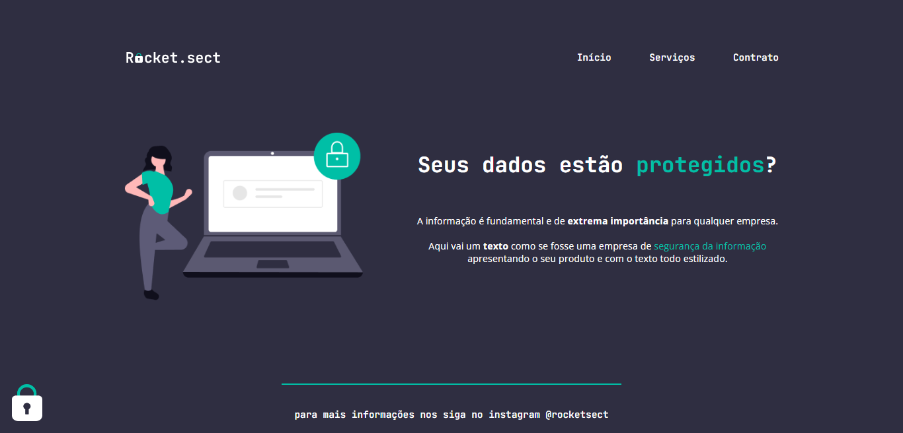

<h1 align="center"> Recriando Layout 2</h1>

Desafio Avançado do treinamento da Rocketseat para ensino de tecnologias WEB.

  <a href="#-tecnologias">Tecnologias</a>&nbsp;&nbsp;&nbsp;|&nbsp;&nbsp;&nbsp;
  <a href="#-projeto">Projeto</a>&nbsp;&nbsp;&nbsp;|&nbsp;&nbsp;&nbsp;
  <a href="#-layout">Layout</a>&nbsp;&nbsp;&nbsp;|&nbsp;&nbsp;&nbsp;
  <a href="#memo-licença">Licença</a>

  

 

  

## 🚀 Tecnologias

Esse projeto foi desenvolvido com as seguintes tecnologias:

- HTML e CSS
- Git e Github
- Figma

## 💻 Projeto

O projeto é um desafio de recriar um website a partir de seu layout no figma.

## 🔖 Layout

Você pode visualizar o layout do projeto através [DESSE LINK](https://www.figma.com/file/7AeCPh9LW2NSEvd4vo1Lix/Explorer-(Copy)?type=design&node-id=0-1&mode=design&t=0020jTM84Fqm19QL-0). É necessário ter conta no [Figma](https://figma.com) para acessá-lo.

## :memo: Licença